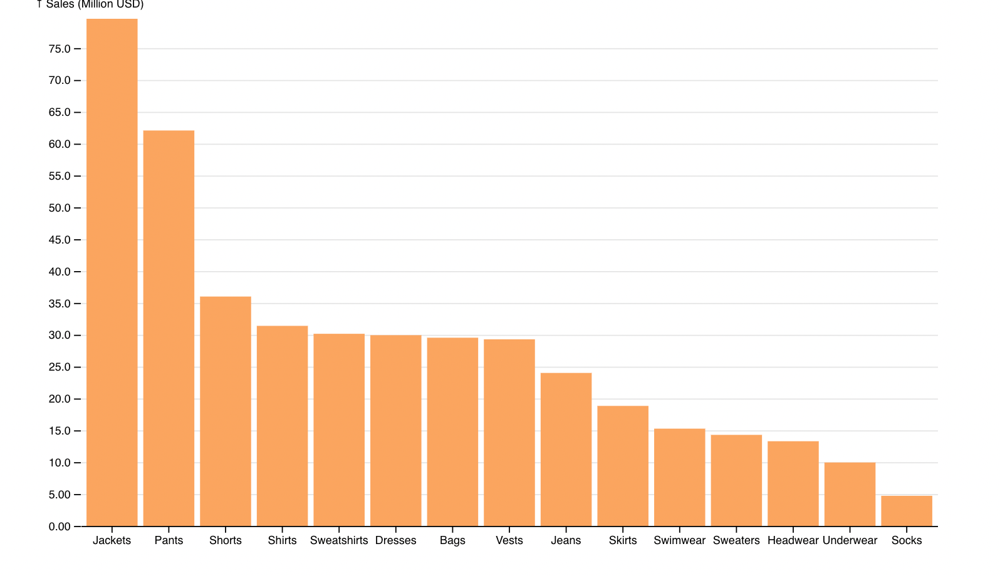
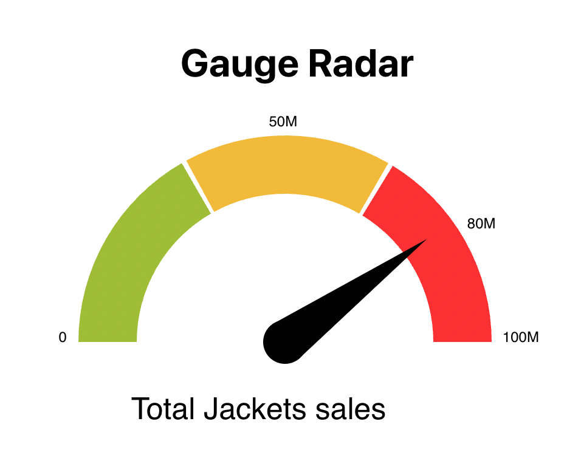
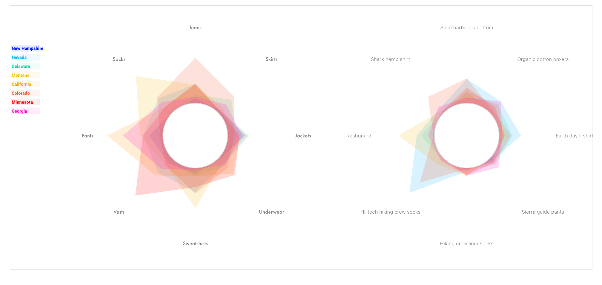
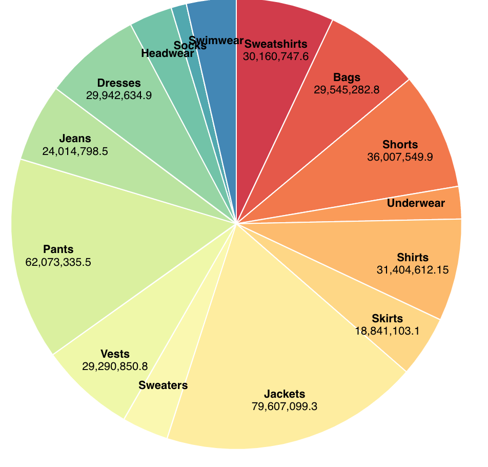
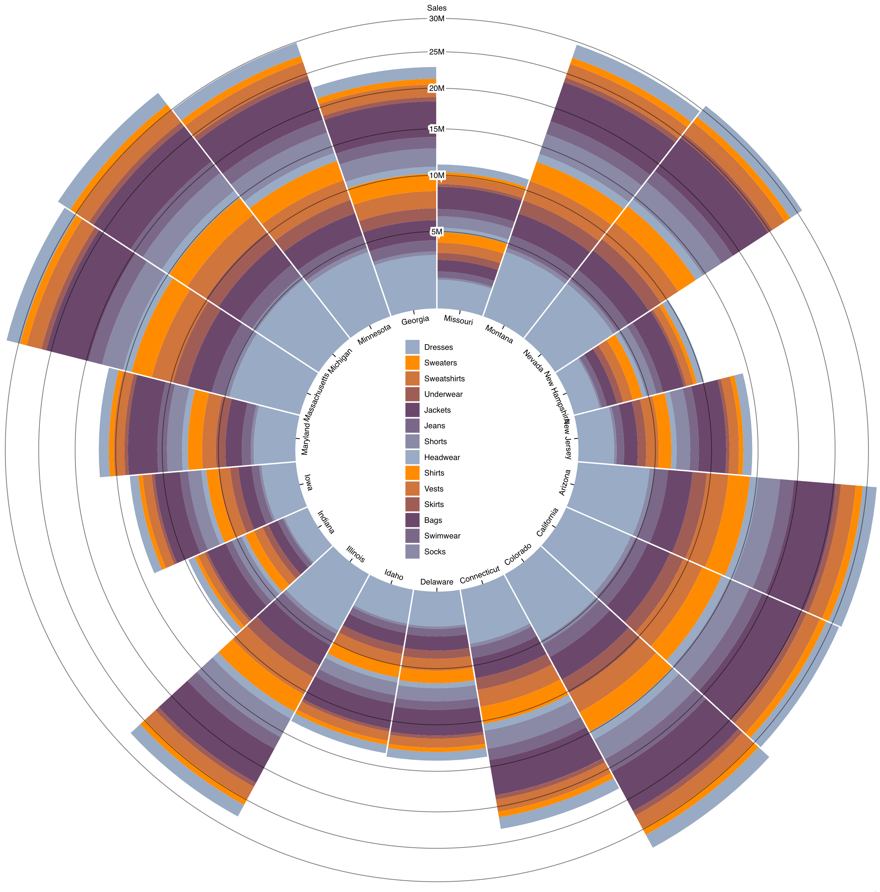
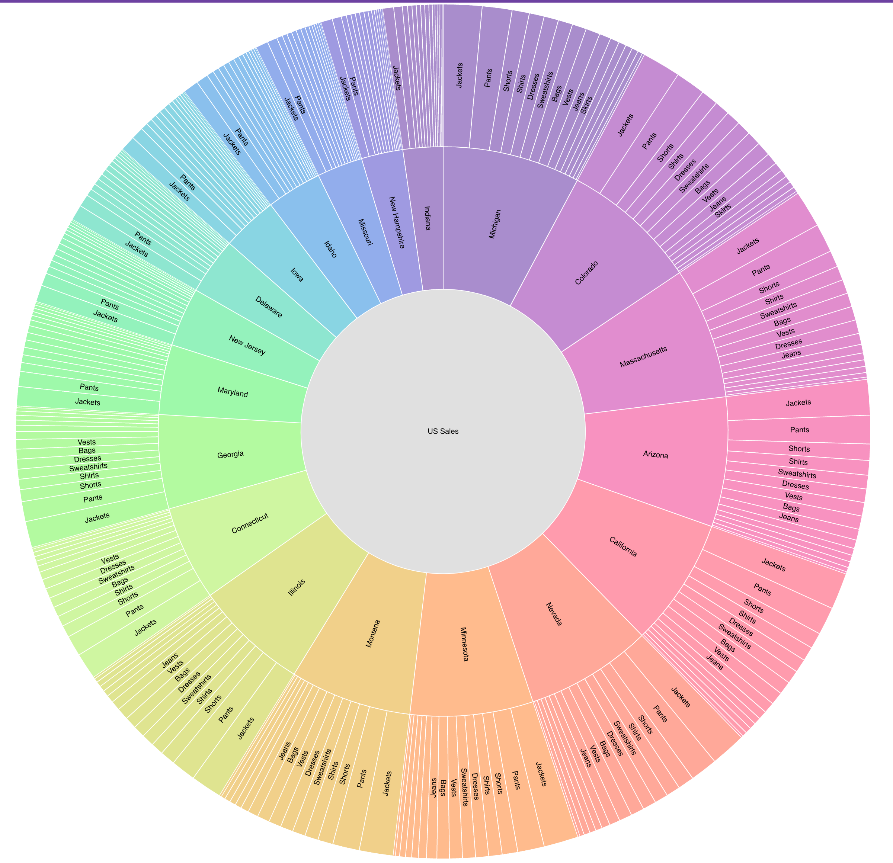
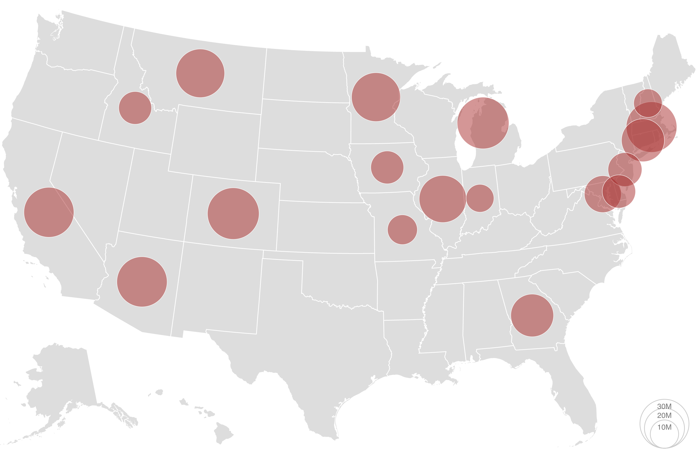
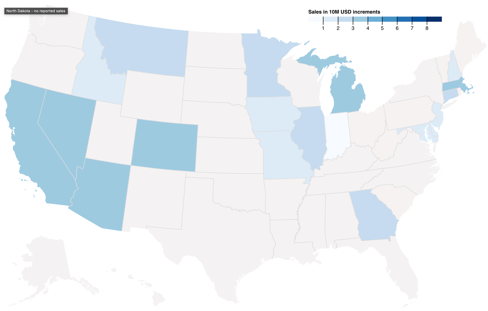
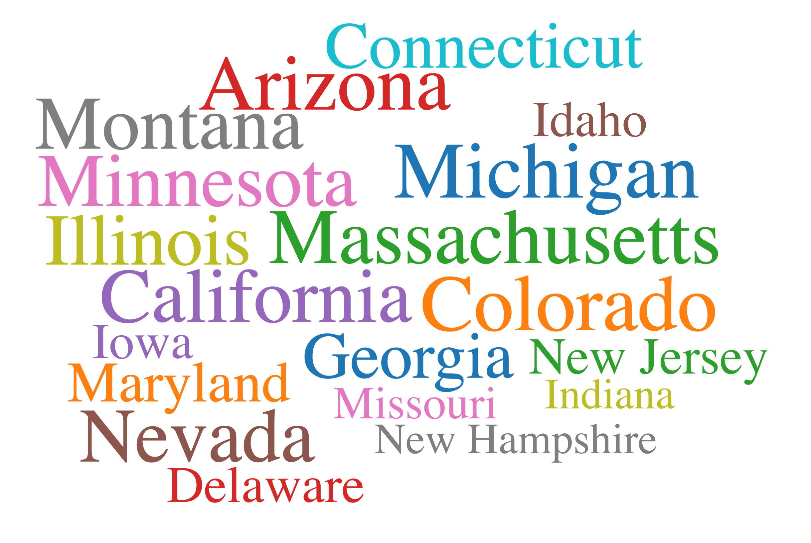

# ThoughtSpot Everywhere D3 Sample Showcase
This app is an example react-based app for embedding 3D Charts using [Thoughtspot Search Rest API](https://developers.thoughtspot.com/docs/?pageid=search-data-api). It is designed to work with the Sample Retail Apparel dataset included with the ThoughtSpot Free Trial account.

It contains example code for:
- basic authentication to TS API using username and password, must launch the app using React environment variables. For more information see https://create-react-app.dev/docs/adding-custom-environment-variables/.
- D3 chart examples showcasing data from the TS API

## How to use

### Sign up for Free Trial account
You will need a ThoughtSpot Free Trial account [here](https://www.thoughtspot.com/trial). 

### Clone Github Repo
Clone the ThoughtSpot Quickstarts repo.

`git clone https://github.com/thoughtspot/[YOUR_REPO].git`

Change directories to `[YOUR_DIRECTORY]`

### Install dependencies

`npm install`

 ### Run the app

You can define environment variables and launch directly as follows:

 `REACT_APP_TS_URL=YOUR_INSTANCE_URL REACT_APP_TS_USERNAME=YOUR_USERNAME REACT_APP_TS_PASSWORD=YOUR_PASSWORD npm start`

Or you can define your variables in a local [.env](https://create-react-app.dev/docs/adding-custom-environment-variables/) file (one has been provided in this project. Simply rename dotenv to .env and add your values) and run:

 `npm start`

Once the app is running, you can navigate to http://localhost:8000 to check it out. Try navigating to one of the subpages via the hamburger menu.

### Charts included

The following charts are included, with all code in the components folder.
* Bar Chart

* Gauge

* Interactive Radar

* Pie Chart

* Radial Stacked Bar

* Sunburst

* Bubble Map

* State Choropleth Map

* Word Cloud

### Data
This app uses the sample retail dataset which comes preloaded with your ThoughtSpot free trail environment. Within each example chart, a worksheet id and search term is included. You can play with these values to retrieve your own data and then change field mapping to the D3 chart.

`const worksheetID = "cd252e5c-b552-49a8-821d-3eadaa049cca";`
`const search = "[sales] [item type]";`

